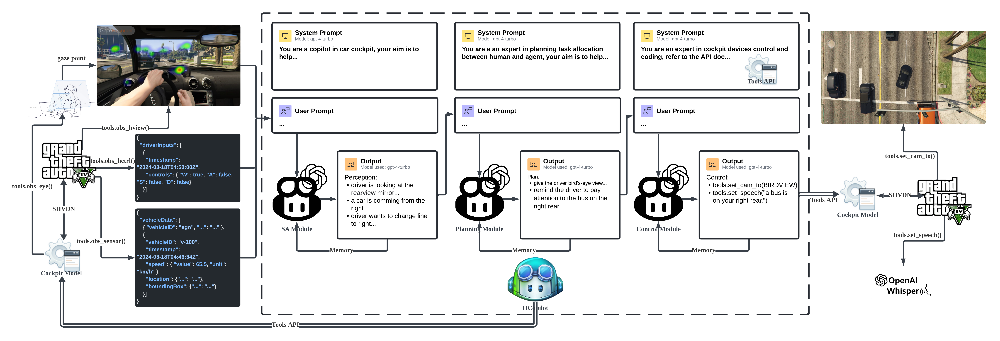

# HCockpit

HCockpit is a sophisticated agent architecture designed to enhance situation awareness in automotive cockpit environments. HCockpit integrates cutting-edge large multimodal models (LMMs) to facilitate effective communication and collaboration between human drivers and autonomous driving systems.

To assess the efficacy of HCockpit and garner a deeper understanding, this project developed HCopilot as an AI copilot agent following the HCockpit architecture and tested HCopilot in the GTAV simulation environment.



See the [report](./docs/Hu%20Yitong_2020213350_FinalReport.pdf) and [slides](./docs/viva/Hu%20Yitong_2020213350_FinalViva.pdf) for more details.

## Quickstart

### Installation

1. Clone the repository

   ```bash
   git clone https://github.com/Wiederholung/HCockpit.git
   ```

2. Navigate to the project directory

   ```bash
   cd HCockpit/src
   ```

3. Create a virtual environment and install the dependencies

   Using `conda` (recommended):

   ```bash
   conda env create -f environment.yml
   ```

   ```bash
   conda activate HCockpit
   ```

   or using `pip`:

   ```bash
   # assuming you have activated a virtual environment named 'HCockpit'
   pip install -r requirements.txt
   ```

### Usage

- For a quick test, you can directly run all cells in the [notebook](./src/hcopilot.ipynb) to see a demo in the `chang_lane` scenario.

- To test other scenarios, you only need to change the `scenario` variable in the `Load Data` cell to one of the following scenarios:

  ```python
  scenarios = ["change_lane", "turn_right-r", "turn_right-l", "dead_zone", "dazzle", "phone"]
  # change driving scenario here
  scenario = scenarios[n]
  ```

  Then run the notebook cell `Load Data` and `Main` again to see the results.

- If you want to test another prompt, modify this [markdown file](./src/prompt.md) and run the notebook cells including `Orchestrate Prompt` and below to see the changes.

- See the [notebook](./src/hcopilot.ipynb) for more detailed instructions on how to use HCockpit.
