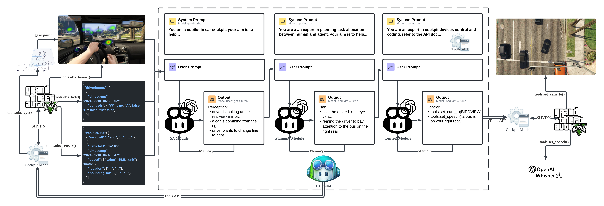

# Design and Development of a Human-Agent Collaboration Model for Situation Awareness in Cockpit

## Abstract

The introduction of autonomous driving technology has led to significant advancements and challenges, especially in achieving seamless human-agent collaboration (HAC) at various automation levels. This paper presents HarmonyCockpit (HCockpit), an advanced agent architecture designed to enhance situational awareness (SA) in automotive environments. HCockpit employs state-of-the-art large multimodal models (LMMs) to enable effective communication and collaboration between human drivers and autonomous driving systems. By integrating insights from both the vehicle's internal and external environments, HCockpit creates context-aware tasks in natural language, which are then converted into actionable directives within a predefined cockpit model. This coordination helps align human and agent actions towards unified outcomes, thereby enhancing the driving experience and safety. Experimental validations in a simulated environment (GTAV) show HCockpit's capability to reduce cognitive load and improve situational awareness for drivers, particularly in complex driving scenarios. The architecture not only demonstrates the potential of LMMs in practical applications but also advances the field of human-agent collaboration in autonomous driving.

## Keywords

human-agent collaboration, context awareness, situation awareness, implicit interaction

## Introduction

As the era of fully autonomous driving approaches, autonomous driving systems still require time to handle diverse situational challenges, environmental variables, and unforeseen circumstances. Prior to full automation, this process will be gradual, signifying the necessity for human supervision. Meanwhile, as autonomous driving technology evolves, it introduces a range of new challenges. Currently, many original equipment manufacturers (OEMs) are adopting Level 2+ or Level 3 autonomous driving features, which allow drivers to temporarily relinquish control of specific driving functions, thus balancing vehicle performance and cost-effectiveness.

However, these systems may intermittently require human re-engagement in vehicle operation; conversely, drivers may need the support of automatic systems in certain scenarios. At this level of autonomous driving, achieving smooth communication and collaboration between drivers and automated systems is crucial to enhancing the driving experience and safety. First, establishing an efficient, transparent communication mechanism between automated systems and human drivers to ensure rapid and accurate information exchange at critical moments is a significant challenge. Second, how to process and integrate information from various sensors and data sources to achieve accurate situational awareness is a key issue in system design.

This project explores a sophisticated interaction system, HarmonyCockpit (HCockpit), aimed at promoting situational awareness by combining insights from the vehicle's internal and external environments, serving as a bidirectional link between the automated system and the driver, and coordinating actions to facilitate context-aware human-machine collaboration tasks. HCockpit is a novel agent architecture designed to incorporate cutting-edge large multimodal models (LMMs) and orchestrate human-agent collaboration (HAC) in the cockpit with transparency. HCockpit achieves situational awareness by integrating insights into both the internal and external environments of the cockpit and generates natural language-level tasks in context-awareness to facilitate HAC. Subsequently, HCockpit translates tasks into actions adapting to a predefined cockpit model, thereby guiding both humans and agents towards coordinated action. Metaphorically speaking, within a cockpit setting that includes a human driver and an autonomous driving system (agent), HCockpit serves as the orchestrating force between human and agent.

In designing HCockpit, this paper conducted a series of experiments in the GTAV simulation environment to test and validate the system's effectiveness. Experimental results indicate that HCockpit effectively enhances the situational awareness of drivers and reduces their cognitive load, especially in complex or emergency driving situations. The HCockpit architecture not only demonstrates the feasibility of achieving effective human-machine collaboration in advanced autonomous driving environments but also proves the potential of large multimodal models in practical applications. Through this project, the paper not only enhances the driving experience and safety but also provides robust technical support for addressing attention concentration issues.

The following sections of this paper will detail the research background, design, and implementation of HCockpit, including the system architecture, key technological components, and the experimental setup and results in the GTAV simulation environment. Finally, the paper will discuss the practical applications of HCockpit and future research directions.

## Background

## Design and Implementation

This section progressively introduces the background, design, and implementation of HCockpit. Initially, the Preliminaries section introduces the basic concepts and terminologies involved in this paper and provides foundational assumptions and modeling. Subsequently, the HCockpit Architecture section systematically presents the modular architecture of HCockpit and explains the design rationale behind it. Finally, the HCopilot Implementation section details the specific implementation of HCopilot (an AI copilot developed following HCockpit architecture).

### Preliminaries

#### Environment, Entity, and Agent

The environment consists of all entities within it, where entities interact with each other. However, entities have varying levels of intelligence; some can only passively respond to stimuli from the environment, while others can actively observe the environment and form a certain understanding, then autonomously plan and execute a series of actions to pursue specific goals. To distinguish between these, this paper refers to the second type of entity as an agent. From the agent's perspective, all other entities in its environment are perceivable or controllable objects. Naturally, the agent's ability to perceive or control other objects depends on its capabilities.

This paper defines the global environment as consisting of the external environment outside the ego vehicle and the internal environment. The external environment includes entities like the road, traffic, and other vehicles, while the internal environment consists of devices defined by the cockpit model and three types of agents: 1. autonomous driving system (AI driver), 2. human driver, and 3. AI copilot (an agent developed following HCockpit architecture). The first two are considered independent homomorphic agents, meaning they have the same observation space (the external environment). Unlike them, the AI copilot has global observation, meaning it can perceive all entities in both the internal and external environments.

#### Action

Action refers to the control executed by an agent on entities in the environment, representing the final step in achieving its goals or responding to environmental changes. In an environment with multiple agents, from the ego agent's perspective, unlike directly controlling an entity, it may be challenging to directly control other agents; instead, it needs to communicate its intentions to others to achieve a certain goal.

In this paper, since the AI driver and human driver are homomorphic agents, they share the same action space, which is the control of the vehicle's motion controller. The AI copilot (considered as the ego agent in this paper), however, has a different action space, which is to control the devices, including the motion controller, in the cockpit.

It is noteworthy that in real driving scenarios, human drivers might control not only the motion controller but also improve the driving experience by controlling cockpit devices such as the dashboard, display screen, and air conditioning. The HCockpit architecture initially considered such scenarios, but to simplify the problem for rapid validation of HCockpit's usability, this paper restricts the human driver's actions to controlling the motion controller. Moreover, this paper does not consider the scenario where the human driver and AI driver jointly control the motion controller, as this often exacerbates the human driver's driving burden, which contradicts the initial intention of this paper.

#### Human-Agent Collaboration

Human-Agent Collaboration (HAC) refers to the process where both parties achieve a specific goal in a shared environment. In this paper, HAC is the ultimate goal of the AI copilot, referring to the AI driver and human driver jointly achieving a safe, comfortable, and efficient driving experience in a shared driving environment. The HAC goals focused on in this paper include: 1. Utilizing the AI driver's environmental perception capabilities to enhance the driver's situational awareness, 2. Combining the human driver's state to provide driving style suggestions to the AI driver. To achieve the HAC goals, the AI copilot needs to decompose this complex goal into a series of simple sub-tasks (HAC tasks), such as: 1. Controlling relevant hardware in the cockpit to send voice reminders or video streams to the driver, 2. Providing control suggestions or takeover requests to the AI driver based on the driver's situational awareness. Since the AI copilot does not have a physical entity, cockpit devices will serve as the tools for executing HAC tasks (embodied), requiring the AI copilot to master the control of cockpit devices.

#### Cockpit Model

This paper introduces the cockpit model as a simplified model of the cockpit environment. The cockpit model defines the functions of all devices within the cockpit and the control permissions of different roles (agents). Technically, the cockpit model provides a unified application programming interface (API). This allows the AI copilot to finely use the functions of cockpit devices to complete HAC tasks. It is worth noting that the cockpit model does not involve the specific control details of devices but has designed a simple device control interface for evaluation and demonstration.

#### Large Multimodal Model

Large Multimodal Model (LMM) refers to the general term for generative pre-trained deep learning models that can handle multiple input modalities (such as text, images, etc.) and generate text outputs. The input to an LMM is usually referred to as "prompt," which contains the task description and input data for the model.

In this paper, LMMs are used to implement the core functions of the AI copilot, including situational awareness, task orchestration, and control. Thanks to LMM's broader general knowledge and advanced reasoning capabilities, the AI copilot can understand complex traffic environments and the intentions of human drivers in real driving scenarios, thereby appropriately assisting human drivers. As of April 2024, the most advanced LMM is developed by OpenAI, GPT-4 Turbo, which can be accessed via the OpenAI API.

### HCockpit Architecture

Figure xxx shows the overall architecture of HCockpit, which models three types of agents (human driver, AI driver, and AI copilot) and two types of entities (cockpit devices and external entities). Specifically, the human driver and AI driver perceive information from cockpit devices and external entities, then control the motion controller within cockpit devices. It is noteworthy that their perceptions and control methods of entities differ. The human driver perceives cockpit devices and external entities through visual, auditory, and tactile means, then directly physically controls the motion controller; the AI driver perceives external entities using onboard sensors and interacts with cockpit devices (perception and control) according to the API defined by the cockpit model.

For the AI copilot, it perceives the behaviors of the human driver and AI driver through cockpit devices and collects observations from the AI driver on external entities, aggregating them to obtain a global observation of the environment. Based on this global observation, the AI copilot's goal is to control cockpit devices to communicate with the human driver and AI driver to complete HAC tasks. To achieve this goal, the text hierarchically designs four modules for the AI copilot in HCockpit: the situation awareness module, planning module, memory module, and control module, which will be introduced one by one below.

#### Situation Awareness Module

The AI copilot needs to continuously observe the global environment (external + internal) to achieve situational awareness (SA). For the internal environment, this paper only considers the cockpit's main driver. Devices like cameras, eye trackers, microphones, and motion controllers in the cockpit will continuously record the behavior of the human driver. Through communication with cockpit devices, the SA module can receive multimodal data inputs containing natural language instructions, physiological and control data from the driver, use LMM to extract semantic information and driver intentions from the scene, and then save it as structured state text as an observation of the internal environment. It should be noted that the SA module does not observe the state of the AI driver because when the human driver predominantly controls the vehicle, there is no need to consider the AI driver's strategy or intentions; conversely, when the AI driver predominantly controls, the human driver's intentions or preferences are crucial.

For the external environment, the SA module obtains observations of external entities through the AI driver's sensors and uses LMM to obtain interpretable environmental semantic information and projections of future states and events. Similarly, the SA module saves the above information as state text, serving as an observation of the external environment.

Subsequently, the SA module aggregates the two observations into structured global observation state text, allowing the AI copilot to further analyze and make decisions.

#### Planning Module

The planning module, combining comprehensive SA and context of the global environment, orchestrates tasks to facilitate HAC. Specifically, the planning module receives input of global observation state text, then analyzes the human driver's goals or needed assistance, identifies specific HAC goals, and arranges HAC tasks. During this process, the planning module follows the principle of prioritizing driving safety followed by driving experience.

The opacity of intelligent system decisions can hinder the establishment of human-agent trust, potentially leading human drivers to question the system's decisions, leading to attentional tunneling and affecting driving safety. The design of the planning module takes this into account; driven by LMM, its HAC goals and tasks are described in natural language, which is easy to understand and helps enhance human-agent trust and driving safety.

#### Memory Module

Since the AI copilot's assistance is a continuous process, context awareness is crucial. Inspired by xxx, this project designed the memory module for HCockpit, which separately saves the historical inputs and outputs of the SA module and planning module and uses custom summarization techniques to provide appropriate context information for LMM, enabling the AI copilot to provide more comprehensive task orchestration.

#### Control Module

The control module is the execution module of the AI copilot, which receives natural language level HAC tasks generated by the planning module and converts them into control codes for cockpit devices through the API defined by the cockpit model. The control module is also driven by LMM, essentially a text-to-code converter that combines external knowledge bases (API document).

From the perspective of automation and control systems, the control module can be seen as a controller, where its input is HAC tasks (reference), the output is control codes for cockpit devices (control input), and the various devices in the cockpit serve as the plant, forming a simple feedforward control system.

### HCopilot Implementation

To assess the efficacy of HCockpit and garner deeper understandings, this paper developed HarmonyCopilot (HCopilot) as an AI copilot agent following the HCockpit architecture and tested HCopilot in the Grand Theft Auto V (GTAV) simulation environment.

HCopilot employs the state-of-the-art LMM (GPT-4 Turbo) and integrates a demonstrative intelligent cockpit model and tools API for controlling vehicle cockpit devices in GTAV. Internally, HCopilot adopts the design of LMM as an agent, meaning each module (except the memory module) is an independent LMM instance. Therefore, this paper uses the LangChain framework to implement the information transfer between modules and module-to-module communication, as well as automatic context summarization.

#### Tools API

GTAV is a globally renowned open-world game that realistically recreates the urban environment and traffic scenes of Los Angeles, providing players with a realistic first-person driving experience, as shown in Figure x. ScriptHookVDotNet (SHVDN) is a runtime that interfaces between custom .NET code and GTAV, running under Script Hook V to utilize GTAV script native functions in custom *.asi plugins.

This paper defines a basic functionality cockpit model for GTAV and develops cockpit device APIs based on SHVDN and other packages. From the perspective of HCopilot, these APIs are referred to as tools API, which can be invoked by HCopilot. Specifically, the tools API includes control and perception functions:

1. `set_cam_to()`: Controls the external camera of the ego vehicle to lock onto a specific entity or location and displays the video stream on the Head-Up Display (HUD).
2. `set_speech()`: Controls the cockpit's speakers to read aloud a specific text.
3. `obs_eye()`: Obtains the video stream of the player (human driver) through a network camera, then uses the Beam Eye Tracker and OpenTrack to obtain the human driver's eye movement data, including gaze coordinates, returning array format data.
4. `obs_hctrl()`: Communicates with GTAV via SHVDN to obtain the human driver's control data, including keyboard input, returning JSON format data.
5. `obs_sensor()`: Uses SHVDN to obtain external environmental data of the ego vehicle, including information on vehicles within a 50-meter radius (relative coordinates, speed, acceleration, and collision box, including the ego vehicle), returning JSON format data.
6. `obs_hview()`: Uses SHVDN to obtain the first-person view image of the human driver, returning png format image.

#### Data Collection

HCopilot calls the `obs_eye()` function at a frequency of 30 Hz to obtain the gaze coordinates of the human driver and generates heatmaps at a frequency of 0.5 Hz. Simultaneously, HCopilot calls the `obs_hctrl()`, `obs_sensor()`, and `obs_hview()` functions at a frequency of 0.5 Hz and overlays the gaze point heatmap on the first-person view image. Figure x fully demonstrates the data collection process of HCopilot.

#### Prompt Engineering

Prompt, also known as the input to the LMM, is the description of the model input data and the task. For OpenAI's GPT-4 Turbo model, the commonly used prompt consists of a system prompt and a user prompt. The system prompt is the initial input to the model, used to guide or set the background of the dialogue. The user prompt is the information entered by the user, used to guide the model to provide specific answers or perform tasks. The design of the prompt directly affects the quality of the LMM's output, so it needs to be carefully designed and continuously optimized, a process known as prompt engineering. OpenAI's prompt engineering guide proposes the following tactics:

1. Include detailed information in the query to obtain more relevant answers.
2. Ask the model to adopt a persona.
3. Use delimiters to clearly indicate different parts of the input.
4. Follow the chain-of-thought (CoT) prompting, specifying the steps required to complete the task.
5. Provide examples.

The SA module, planning module, and control module prompts of HCopilot all follow the above tactics to ensure the quality of LMM's output. For example, in the SA module, for tactic.1, the system prompt mentions: "You are the AI copilot in a car cockpit environment...". For tactic.4, the system prompt specifies the steps required to complete the task: "1. Analyse the human driver's eye gaze and control data, 2. Observe the external environment, 3. Conduct a comprehensive analysis...". The complete prompts for the three modules are shown in Additional Appendices.

#### Overall Workflow

Figure x shows the overall workflow of HCopilot. In the SA module, GPT-4 Turbo processes the input multimodal data, extracting semantic information and driver intentions, and saves these as structured state text. The memory module then stores this state text, providing appropriate context for the LMM. The planning module analyzes the human driver's goals or required assistance, identifies specific HAC goals, and organizes HAC tasks. Finally, the control module converts HAC tasks into control codes for cockpit devices to execute these tasks.

LangChain is an open-source framework designed to integrate LMMs with external APIs and data sources for broader application scenarios. HCopilot uses the LangChain framework to implement prompt templates and variable replacement in outputs, call tools API, facilitate information transfer between modules, and automate context summarization.

## Results and Discussion

This section demonstrates HCopilot's capabilities in real urban and traffic scenarios within GTAV for situation awareness, task orchestration, and control, enhancing the driver's experience and safety through five designed city driving scenarios. The prototype HCopilot effectively enhances situational awareness through HUD and voice alerts based on the human driver's behavior and external environment changes, thus improving driving experience and safety.

### Scenario 1: Lane Change

As shown in Figure x, the human driver attempts a right lane change. HCopilot, observing the driver's eye movement and control data, accurately assesses the driver's intent and opts to display a real-time bird's-eye view on the HUD to enhance situational awareness, aiding the driver in safely completing the lane change. Even after the driver notices the rear vehicles, HCopilot continues to display the video stream, considering the enhancement of the driving experience.

### Scenario 2: Turn Right at Intersection

In this scenario, as shown in Figure x, the human driver is turning right at an intersection, focusing on vehicles in the opposite lane. HCopilot accurately judges the driver's intent and realizes the driver has not noticed traffic from the sides, thus choosing to display a bird's-eye view on the HUD and issuing a voice alert.

When reaching the moment shown in Figure x, the driver's gaze indicates awareness of the oncoming traffic from the left, prompting HCopilot to cease the video stream, showcasing its intelligence in assisting the driver.

### Scenario 3: Too Bright to See

In the scenario depicted in Figure x, the driver encounters direct sunlight. A vehicle from the left approaches, unnoticed by the driver due to glare, who opts to proceed slowly. HCopilot, noting this, chooses to display a real-time video of vehicle v-100 on the HUD and issues a voice alert, prioritizing the threat over enhancing spatial awareness.

### Scenario 4: Blind Area

In the scenario shown in Figure x, the driver is checking a blind spot. HCopilot opts to enhance situational awareness by displaying a real-time video of the vehicle in the blind spot on the HUD, without using a voice alert as the driver is already aware of the potential threat.

### Scenario 5: Low Attention

In the scenario shown in Figure x, the driver is approaching an intersection, focused on a mobile phone. HCopilot chooses to issue a voice alert for the driver to prepare to brake, to avoid a collision with the vehicle ahead.

### Discussion

HCopilot's implementation showcases its effectiveness and adaptability in complex urban driving environments. Through five different driving scenarios, it is observed how HCopilot enhances the driver's situational awareness and safety through real-time video streams and voice alerts. Specifically:

1. **Effectiveness in Enhancing Situational Awareness**: In all scenarios, HCopilot effectively enhances environmental awareness by providing additional visual information and voice alerts, aiding drivers in making safer decisions, especially during lane changes, blind spot checks, and low attention scenarios.

2. **Adaptability and Intelligence of the System**: HCopilot demonstrates adaptability by adjusting its assistance strategy based on the driver's behavior and changes in the external environment. For example, it ceases video streaming when it detects that the driver has noticed a potential threat, reducing information overload and showing an understanding of human behavior.

3. **Enhancement of Driving Experience**: While HCopilot's interventions primarily enhance safety, they also improve the driving experience by reducing uncertainty and stress, making the driving process more relaxed and enjoyable. However, this positive impact needs validation across a broader driving population to ensure the system's universal applicability and acceptance.

## Conclusion and Future Work

### Conclusion

This paper introduces a novel human-agent collaboration (HAC) framework centered around large multimodal models (LMMs) to enhance situational awareness (SA) in the cockpit. By integrating the perceptual and control capabilities of human drivers and AI driving systems, the HCockpit architecture successfully facilitates effective communication and collaboration between humans and machines. The experimental results demonstrate significant improvements in the driving experience and safety, especially in scenarios involving blind spots and distracted driving.

The technical implementation leverages the latest LMM, such as GPT-4 Turbo, allowing HCockpit to understand complex traffic environments and human driver intentions, generating appropriate tasks and control commands. Additionally, the designed communication mechanism ensures transparency in system decisions, helping to enhance human understanding and trust in the system.

Despite achievements, challenges such as precise alignment of multimodal data and real-time data processing to meet system performance requirements were encountered. Solutions to these issues largely rely on continuous optimization of data processing techniques and algorithm improvements.

Given more time for this project, exploration of advanced techniques for multimodal data fusion to improve system accuracy and response times would be pursued. Further, incorporating more user feedback mechanisms to optimize the human-machine interaction interface would be considered.

### Reflection

This project was not only a technical challenge but also a profound learning and growth experience. Through this research, a deeper understanding of the potential and challenges of artificial intelligence in practical applications was gained. Moreover, experiences in team discussions taught effective communication and problem-solving under pressure, significantly benefiting professional development.

The successful implementation of the project validates the research direction and methodology, positively impacting academic and personal development. It enhanced technical capabilities and improved project management and decision-making skills.

### Future Work

Future research will continue in the following directions:

1. **Entity Alignment Optimization**: Improving entity alignment techniques between different perspectives to enhance overall system performance and accuracy.
2. **Gaze Point Embedding Techniques**: Exploring embedding driver gaze data in vector form into the system decision-making process for more accurate behavior prediction and assistance.
3. **Local Real-Time Operation of LMMs**: Researching how to run large multimodal models in real-time locally, reducing reliance on cloud computing resources and enhancing system responsiveness and reliability.
4. **Unified and Standardized Cockpit Device Control Interface**: Collaborating with industry peers to promote the establishment of a unified and standardized cockpit device control interface, enabling seamless integration from high-level HAC tasks to specific device controls.

Through these studies, further enhancement of HCockpit's performance and practicality, contributing to the development of future intelligent transportation systems, is anticipated.

## References

## Acknowledgement

## Appendices

## Risk and Environmental Impact Assessment
