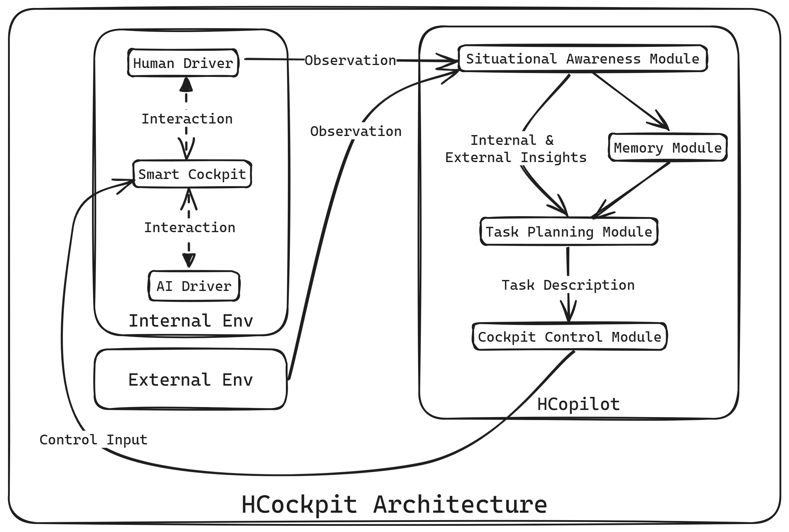

# Design and Development of a Human-Agent Collaboration Model for Situation Awareness in Cockpit

## Abstract

## Keywords

> 以人为本

human-agent collaboration, context awareness, situation awareness, implicit interaction

## Introduction

> 1. 引入（发展...）
> 2. 挑战
> 3. 提出了什么（HCockpit），功能（ill图片：拟物风，agent-env形式），设计（略）
> 4. 实验 insights
> 5. 结论与贡献（框架+LLM实例）
> 6. 论文结构

This paper introduces HarmonyCockpit (HCockpit), an agent architecture designed to incorporate cutting-edge large multimodal models (LMMs) and orchestrate human-agent collaboration (HAC) in cockpit with transparency.

> how it works

The HCockpit achieves situation awareness by integrating insights into both the internal and external environments of the cockpit and generates natural language-level tasks in context-awareness to facilitate HAC. Subsequently, HCockpit translates tasks into actions adapting to predefined cockpit model, thereby guiding both humans and agents towards coordinated action. Metaphorically speaking, within a cockpit setting that includes a human driver and an autonomous driving system (agent), the HCockpit serves as the orchestrating force between human and agent.

> illustrate the func
>
> 例如，如图[1]所示，HCockpit 通过观察驾驶员的语言和生理数据，以及外部环境的视觉信息，生成了一个驾驶员的状态向量，然后根据这个状态向量生成了一个任务，这个任务被翻译成了一个控制建议，最终通过控制建议控制了驾驶舱内的设备。

## Background

## Design and Implementation

本节循序渐进地介绍了 HCockpit 的背景知识、设计与实现。首先，Preliminaries 节介绍了本文涉及的基本概念和术语，并对问题进行了基础的假设和建模。接着，HCockpit Architecture 节系统地介绍了 HCockpit 的模块化架构，并解释了其背后的设计思路。最后，HCopilot Implementation 节给出了 HCopilot (an AI copilot developed following HCockpit architecture) 的具体实现。

### Preliminaries

#### Environment, Entity and Agent

Environment 由其中所有的实体组成，实体之间存在互动。然而，实体们的智能水平不尽相同，一些实体只能被动地响应来自环境的刺激，另一些则可以主动观测环境并形成一定的理解，进而自主规划一定的任务并执行一些列动作，以追求某些目标。为了区分二者，本文称第二类 entity 为 agent。在 agent 的视角中，其所处环境中的所有其他实体都是可感知或可控制的对象。当然，agent 感知或控制其他对象的能力取决于其自身。

本文定义全局环境 consists of the external environment outside the ego vehicle and the internal environment. The external environment includes entities like the road, traffic, and other vehicles, while the internal environment includes entities consisting of devices defined by the cockpit model, and 3 types of agents: 1. autonomous driving system (AI driver), 2. human driver, and 3. AI copilot (an agent developed following HCockpit architecture). The first two are considered independent homomorphic agents, meaning they have the same observation space (the external environment). Differing from them, the AI copilot has global observation, which means it can perceive all entities in both the internal and external environments.

#### Action

Action 指智能体对环境中实体执行的控制，是实现其目标或应对环境变化的最终步骤。对于存在多个 agents 的环境，在 ego agent 的视角中，不同于直接控制 entity，它可能难以直接控制其他 agents，而需要通过通信向对方传递自身的意图以实现某目标。

在本文中，由于 AI driver and human driver are homomorphic agents, they share the same action space, which is the control to the motion controller of the vehicle. The AI copilot (considered as the ego agent in this paper), however, has a different action space, which is to control the devices including the motion controller in the cockpit.

值得注意的是，在真实的驾驶情境中，人类驾驶员可能不仅会控制 motion controller，还会通过控制仪表盘、显示屏、空调等座舱设备改善驾驶体验。HCockpit 架构在设计之初考虑到了此类情况，但是为了简化问题以快速验证 HCockpit 的可用性，本文将人类驾驶员的动作限定在对 motion controller 的控制。此外，本文不考虑 human driverh 和 AI driver 共同控制 motion controller 的情况，因为这种情况往往会加剧 human driver 的驾驶负担，这与本文的初衷相悖。

#### Human-Agent Collaboration

**H**uman-**A**gent **C**ollaboration (HAC) 是指两者在共享环境中共同实现某个目标的过程。在本文中，HAC 是 AI copilot 的终极目标，指的是 AI driver 和 human driver 在共享的驾驶环境中共同实现安全、舒适、高效的驾驶体验。本文重点关注的的 HAC 目标有：1. 利用 AI driver 的环境感知能力增强驾驶员的态势感知，2. 结合人类驾驶员的状态为 AI driver 提供驾驶风格建议。为了实现 HAC 目标，AI copilot 需要将这一复杂的目标分解为一系列简单的子任务（HAC tasks）例如：1. 控制座舱内相关硬件向驾驶员发送语音提醒或视频流，2. 根据驾驶员的态势向AI 驾驶员提供控制建议或接管请求。由于 AI copilot 没有物理实体，cockpit devices 将作为其执行 HAC task 的工具（具身），这要求 AI copilot 掌握对 cockpit devices 的控制能力。

#### Cockpit Model

本文引入 cockpit model as a simplified model of the cockpit environment。Cockpit model 定义了座舱内所有设备的功能以及不同角色（agent）对这些设备的控制权限。技术上，cockpit model 提供了统一的应用程序接口（API）。这样，AI copilot 就可以精细地使用 cockpit devices 功能，以完成 HAC taskes。The cockpit model is designed to be simple and easy to understand, so that it can be used as a testbed for evaluating the HCockpit architecture. 值得注意的是，cockpit model 不涉及具体设备的控制细节，而是设计了一个简单的设备控制接口供评估和演示。

#### Large Multimodal Model

Large multimodal model (LMM) 是生成式预训练深度学习模型的总称，其可以处理多种输入模态（如文本、图像等）并生成文本输出。LMM 的输入通常被称为 "prompt"，其包含了对模型的任务描述和输入数据。截至 2024年4月，最先进的 LMM 是由 OpenAI 开发的 GPT-4 Turbo，which can be used via the OpenAI API.

在本文中，LMM 被用于实现 AI copilot 的核心功能，包括态势感知、任务编排和控制。得益于 LMM's broader general knowledge and advanced reasoning capabilities，AI copilot 可以在真实的驾驶情境下理解复杂交通环境和人类驾驶员的意图，从而适当地协助人类驾驶员。

### HCockpit Architecture

图 xxx 展示了 HCockpit 的总体架构，其中建模了3类 agents (human driver, AI driver and AI copilot) 和2类 entities (cockpit devices and external entities)。具体而言，human driver 和 AI driver 感知来自 cockpit devices 和 external entities 的信息，然后控制 cockpit devices 中的 motion controller。值得注意的是，二者对实体的感知和控制的权限和方式不尽相同。human driver 通过视觉、听觉、触觉等方式感知 cockpit devices 和 external entities，然后直接物理控制 motion controller；AI driver 则借助车载传感器感知 external entities，根据 cockpit model 定义的 API 与 cockpit devices 交互（感知和控制）。

对于 AI copilot，其通过 cockpit devices 感知 human driver 和 AI driver 的行为，并收集来自 AI driver 对 external entities 的观测，聚合后得到对全局环境的观测。基于全局观测，AI copilot 的目标是控制 cockpit devices 向 human driver 和 AI driver 通信以完成 HAC tasks。为了实现这一目标，文本为 HCockpit 中的 AI copilot 层次化地设计了4个模块：situation awareness module, planning module, memory module 和 control module，下面将逐一介绍。

#### Situation Awareness Module

AI copilot 需要持续观测全局环境（舱外+舱内）来完成态势感知（SA）。对于舱内环境，本文只考虑舱内主驾驶员。Devices like camera, eye tracker, microphone and motion controller in cockpit 将持续记录 human driver 的行为。通过与 cockpit devices 的通信，SA module 可以接收包含：驾驶员自然语言指令、生理和控制数据在内的多模态数据输入，利用 LMM 提取场景的语义信息和驾驶员意图，随后保存为结构化的状态文本，作为对内部环境的观测。需要说明，SA module 不会观测 AI driver 的状态，因为人类驾驶员主导控制车辆时不需要考虑 AI 驾驶员的策略或意图；反过来，AI driver 主导控制时，人类驾驶员的意图或偏好则至关重要。

对于舱外环境，SA module 通过 AI 驾驶员的传感器获取对外部实体的观测，并利用 LMM 获取可解释的环境语义信息和 projection of future states and events。类似地，SA module 保存上述信息为状态文本，作为对外部环境的观测。

接下来，SA module 将两个观测聚合为结构化的全局观测的状态文本，以便 AI copilot 进一步分析和决策。

#### Planning Module

Planning module 将结合对于全局环境的全面 SA 和上下文, orchestrates tasks to facilitate HAC具体而言，planning module 接收全局观测的状态文本输入，然后分析 human driver 的目标或需要的帮助，确定具体的 HAC 目标并编排 HAC tasks。在这一过程中，planning module 遵循驾驶安全优先，驾驶体验次之的原则。

智能系统决策的不透明性不利于建立 human-agent 信任，human driver 可能会质疑系统的决策，进而导致 attentional tunneling 并影响驾驶安全。Planning module 的设计充分考虑到了这一点，在 LMM 驱动下，其 HAC 目标和 tasks 都是自然语言描述的，便于理解，有助于提高 human-agent 信任和驾驶安全。

#### Memory Module

由于 AI copilot 的辅助是一个持续的过程，context awareness 是至关重要的。受 xxx 的启发，本项目设计了 HCockpit 的 memory 模块，它可以分别保存 SA module 和 planning module 的历史输入输出，并利用自定摘要技术为 LMM 提供适当的上下文信息，使得 AI copilot 给出更 comprehensive 的任务编排。

#### Control Module

Control module 是 AI copilot 的执行模块，其接收 planning module 生成的 natural language level HAC tasks，并通过 cockpit model 定义的 API 将转化为对 cockpit devices 的控制代码。Control module 同样由 LMM 驱动，其本质是结合外部知识库（API document）的 text to code 转换器。

在在自动化和控制系统的视角下，control module 可以看作是一个控制器，其输入是 HAC tasks (reference)，输出是控制 cockpit devices 的代码（control input），座舱中各个设备则是 plant，组成了一个简单的前馈控制系统。

### HCopilot Implementation

To assess the efficacy of the HCockpit and garner deeper understandings, this paper developed HarmonyCopilot (HCopilot) as an AI copilot agent following the HCockpit architecture, 并在 Grand Theft Auto V (GTAV) 仿真环境中测试了 HCopilot。HCopilot 采用了 state-of-the-art LMM (GPT-4 Turbo), 并针对 GTAV 集成了演示性质的的智能座舱模型和 API，以便于对 GTAV 中车辆座舱设备的控制。HCopilot 内部采用了 LMM as module 的设计，这意味着每个模块（memory module 除外）都是一个独立的 LMM 实例，因此本文还为 HCopilot 开发了 main controller 来协调各个模块的工作。

#### Cockpit Devices API

GTAV 是一个开放世界游戏，游戏中真实地还原了洛杉矶的城市环境和交通场景，并为玩家提供了以第一视角驾驶车辆的拟真体验。ScriptHookVDotNet (SHVDN) is a runtime that interfaces between custom .NET code and GTAV, running under Script Hook V to utilize GTAV script native functions in custom *.asi plugins. 本文在 SHVDN 和其他包的基础上开发了 HCopilot 的座舱设备的 API。具体而言，API 包含了控制和感知2类函数：

1. `set_cam_to()`: 控制 ego 车辆外部摄像头锁定到某个实体或位置，并在 Head Up Display (HUD) 上显示视频流
2. `set_speech()`: 控制座舱内的扬声器朗读某段文本
3. `obs_eye()`: 使用 Beam Eye Tracker 和 OpenTrack 获取 human driver 的眼动数据，包括注视点坐标，返回数组格式数据
4. `obs_hctrl()`: 获取 human driver 的控制数据，包含键盘输入，返回 JSON 格式数据
5. `obs_ext()`: 获取 ego 车辆的外部环境数据，包括半径50米内的车辆信息（相对坐标、速度、加速度和碰撞箱，包含 ego 车辆），返回 JSON 格式数据
6. `obs_hview()`: 获取 human driver 的第一视角图像，返回 png 格式图像

#### Situation Awareness Module

HCopilot 的 SA module 将以 30 hz 的频率调用 `obs_eye()` 函数，获取 human driver 的注视点坐标，并以 0.5 hz 的频率生成热力图。同步地，SA module 将以 0.5 hz 的频率同时调用 `obs_hctrl()`, `obs_ext()` 和 `obs_hview()` 函数，并将注视点热力图叠加在第一视角图像上。接下来，GPT-4 Turbo 将处理这些多模态数据，提取场景的语义信息和驾驶员意图，并保存为结构化的状态文本。具体的 prompt 如下：

#### Planning Module

#### Memory Module

#### Control Module

#### Main Controller

## Results and Discussion

## Conclusion and Future Work

### Conclusion

### Reflection

### Future Work

## References

## Acknowledgement

## Appendices

## Risk and environmental impact assessment
