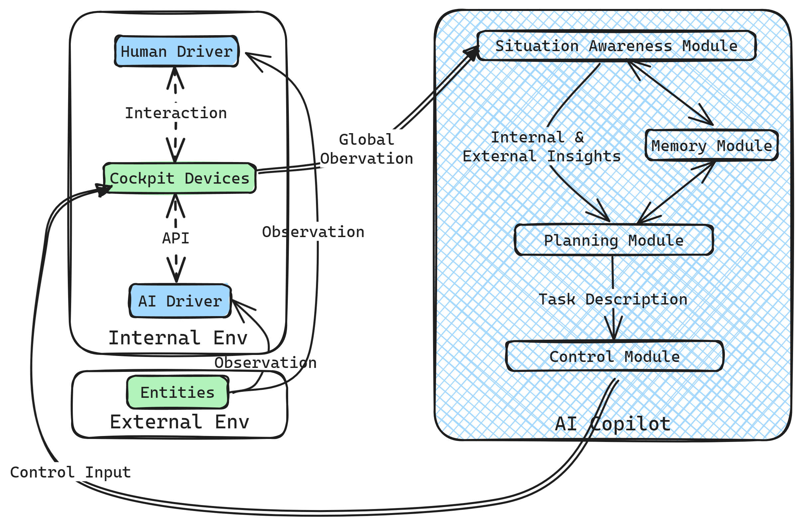
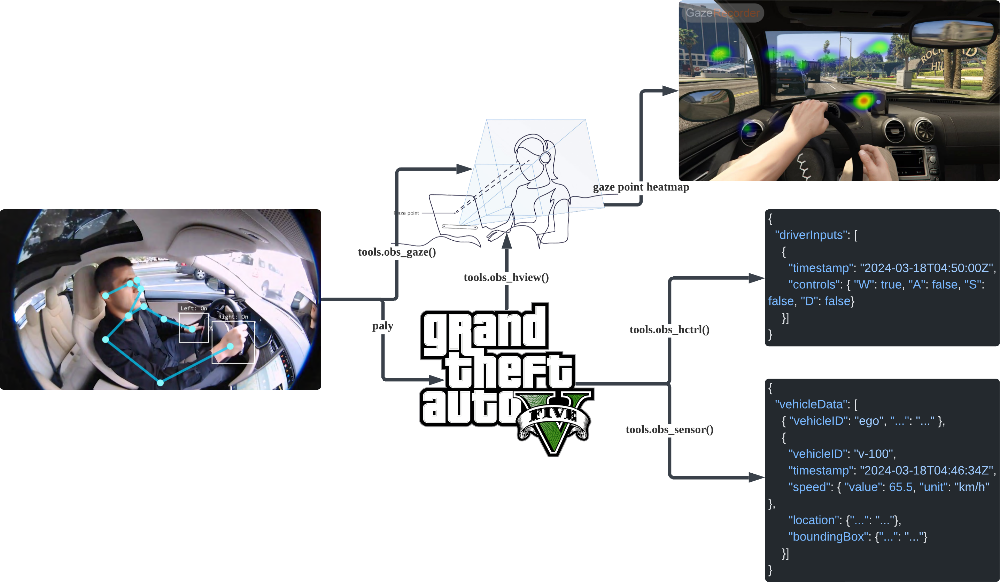
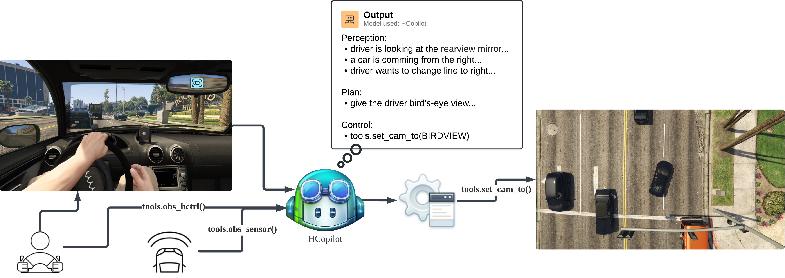
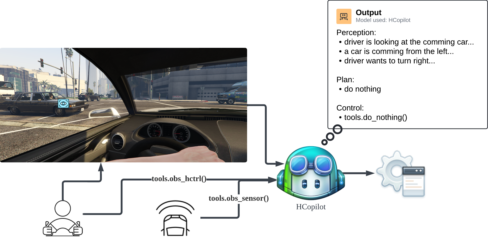

# Design and Development of a Human-Agent Collaboration Model for Situation Awareness in Cockpit

## Abstract

The advent of autonomous driving technology brings significant advancements and challenges, particularly in achieving seamless human-agent collaboration (HAC) at various levels of automation. This paper introduces HarmonyCockpit (HCockpit), a sophisticated agent architecture designed to enhance situational awareness (SA) in automotive environments. HCockpit integrates cutting-edge large multimodal models (LMMs) to facilitate effective communication and collaboration between human drivers and autonomous driving systems. By synthesizing insights from both the vehicle's internal and external environments, HCockpit generates context-aware tasks in natural language, which are then translated into actionable directives within a predefined cockpit model. This orchestration aids in aligning human and agent actions towards coordinated outcomes, thereby improving the driving experience and safety. Experimental validations carried out in a simulated environment (GTAV) demonstrate HCockpit's ability to reduce cognitive load and augment situational awareness for drivers, particularly in complex driving scenarios. The architecture not only showcases the potential of LMMs in practical applications but also advances the field of human-agent collaboration in autonomous driving.

## Keywords

<!-- > 以人为本 -->

human-agent collaboration, context awareness, situation awareness, implicit interaction

## Introduction

<!-- > 1. 引入（发展...）
> 2. 挑战
> 3. 提出了什么（HCockpit），功能（ill图片：拟物风，agent-env形式），设计（略写）
> 4. 实验 insights
> 5. 结论与贡献（框架+LLM实例）
> 6. 论文结构 -->

随着全自动驾驶时代的临近，自动驾驶系统在处理多样化的情境挑战、环境变量和不可预见的情况方面仍需时日。在完全自动化之前，这一进程将是逐步发展的，标志着人类监督的必要性。同时，随着自动驾驶技术的发展，也带来了一系列新的挑战。目前，许多原始设备制造商（OEMs）正在采用2+级或3级自动驾驶功能，这些功能允许驾驶员暂时放弃特定驾驶功能的控制，从而在车辆性能和成本效益之间实现协调。

然而，这些系统可能间歇性地需要人类重新参与车辆操作；相反，驾驶员在特定情景下可能需要自动系统的支持。在这一级别的自动驾驶中，实现驾驶员与自动系统之间的流畅沟通和协作至关重要，以提升驾驶体验和安全性。首先，如何在自动系统和人类驾驶员之间建立高效、透明的沟通机制，以确保双方能够在关键时刻快速、准确地交换信息，是一大难题。其次，如何处理和融合来自多种传感器和数据源的信息，以实现准确的情境感知，也是系统设计中的一个关键问题。

因此，本项目探索了一种复杂的交互系统，即HarmonyCockpit（HCockpit），旨在通过结合车辆内部和外部环境的洞察，促进情境感知，作为自动系统与驾驶员之间的双向连接，并协调行动以促进基于情境感知的人机协作任务。HCockpit is a novel agent architecture designed to incorporate cutting-edge large multimodal models (LMMs) and orchestrate human-agent collaboration (HAC) in cockpit with transparency. The HCockpit achieves situation awareness by integrating insights into both the internal and external environments of the cockpit and generates natural language-level tasks in context-awareness to facilitate HAC. Subsequently, HCockpit translates tasks into actions adapting to predefined cockpit model, thereby guiding both humans and agents towards coordinated action. Metaphorically speaking, within a cockpit setting that includes a human driver and an autonomous driving system (agent), the HCockpit serves as the orchestrating force between human and agent.

在设计HCockpit时，本文在GTAV仿真环境中进行了一系列实验，以测试和验证系统的有效性。实验结果表明，HCockpit能够有效提高驾驶员的情境感知能力并减少其认知负荷，特别是在复杂或紧急的驾驶情境中。HCockpit架构不仅展示了在高级自动驾驶环境中实现有效人机协作的可能性，而且还证明了大型多模态模型在实际应用中的潜力。通过此项目，本文不仅提高了驾驶体验和安全性，还为解决注意力集中问题提供了有力的技术支持。

本文接下来的部分将详细介绍HCockpit的研究背景，设计和实现，包括系统架构、关键技术组件、以及在GTAV仿真环境中的实验设置和结果。最后，本文将讨论HCockpit的实际应用前景和未来的研究方向。

## Background

## Design and Implementation

本节循序渐进地介绍了 HCockpit 的背景知识、设计与实现。首先，Preliminaries 节介绍了本文涉及的基本概念和术语，并对问题进行了基础的假设和建模。接着，HCockpit Architecture 节系统地介绍了 HCockpit 的模块化架构，并解释了其背后的设计思路。最后，HCopilot Implementation 节给出了 HCopilot (an AI copilot developed following HCockpit architecture) 的具体实现。

### Preliminaries

#### Environment, Entity and Agent

Environment 由其中所有的实体组成，实体之间存在互动。然而，实体们的智能水平不尽相同，一些实体只能被动地响应来自环境的刺激，另一些则可以主动观测环境并形成一定的理解，进而自主规划一定的任务并执行一些列动作，以追求某些目标。为了区分二者，本文称第二类 entity 为 agent。在 agent 的视角中，其所处环境中的所有其他实体都是可感知或可控制的对象。当然，agent 感知或控制其他对象的能力取决于其自身。

本文定义全局环境 consists of the external environment outside the ego vehicle and the internal environment. The external environment includes entities like the road, traffic, and other vehicles, while the internal environment includes entities consisting of devices defined by the cockpit model, and 3 types of agents: 1. autonomous driving system (AI driver), 2. human driver, and 3. AI copilot (an agent developed following HCockpit architecture). The first two are considered independent homomorphic agents, meaning they have the same observation space (the external environment). Differing from them, the AI copilot has global observation, which means it can perceive all entities in both the internal and external environments.

#### Action

Action 指智能体对环境中实体执行的控制，是实现其目标或应对环境变化的最终步骤。对于存在多个 agents 的环境，在 ego agent 的视角中，不同于直接控制 entity，它可能难以直接控制其他 agents，而需要通过通信向对方传递自身的意图以实现某目标。

在本文中，由于 AI driver and human driver are homomorphic agents, they share the same action space, which is the control to the motion controller of the vehicle. The AI copilot (considered as the ego agent in this paper), however, has a different action space, which is to control the devices including the motion controller in the cockpit.

值得注意的是，在真实的驾驶情境中，人类驾驶员可能不仅会控制 motion controller，还会通过控制仪表盘、显示屏、空调等座舱设备改善驾驶体验。HCockpit 架构在设计之初考虑到了此类情况，但是为了简化问题以快速验证 HCockpit 的可用性，本文将人类驾驶员的动作限定在对 motion controller 的控制。此外，本文不考虑 human driverh 和 AI driver 共同控制 motion controller 的情况，因为这种情况往往会加剧 human driver 的驾驶负担，这与本文的初衷相悖。

#### Human-Agent Collaboration

**H**uman-**A**gent **C**ollaboration (HAC) 是指两者在共享环境中共同实现某个目标的过程。在本文中，HAC 是 AI copilot 的终极目标，指的是 AI driver 和 human driver 在共享的驾驶环境中共同实现安全、舒适、高效的驾驶体验。本文重点关注的的 HAC 目标有：1. 利用 AI driver 的环境感知能力增强驾驶员的态势感知，2. 结合人类驾驶员的状态为 AI driver 提供驾驶风格建议。为了实现 HAC 目标，AI copilot 需要将这一复杂的目标分解为一系列简单的子任务（HAC tasks）例如：1. 控制座舱内相关硬件向驾驶员发送语音提醒或视频流，2. 根据驾驶员的态势向AI 驾驶员提供控制建议或接管请求。由于 AI copilot 没有物理实体，cockpit devices 将作为其执行 HAC task 的工具（具身），这要求 AI copilot 掌握对 cockpit devices 的控制能力。

#### Cockpit Model

本文引入 cockpit model as a simplified model of the cockpit environment。Cockpit model 定义了座舱内所有设备的功能以及不同角色（agent）对这些设备的控制权限。技术上，cockpit model 提供了统一的应用程序接口（API）。这样，AI copilot 就可以精细地使用 cockpit devices 功能，以完成 HAC taskes。The cockpit model is designed to be simple and easy to understand, so that it can be used as a testbed for evaluating the HCockpit architecture. 值得注意的是，cockpit model 不涉及具体设备的控制细节，而是设计了一个简单的设备控制接口供评估和演示。

#### Large Multimodal Model

Large multimodal model (LMM) 是生成式预训练深度学习模型的总称，其可以处理多种输入模态（如文本、图像等）并生成文本输出。LMM 的输入通常被称为 "prompt"，其包含了对模型的任务描述和输入数据。

在本文中，LMM 被用于实现 AI copilot 的核心功能，包括态势感知、任务编排和控制。得益于 LMM's broader general knowledge and advanced reasoning capabilities，AI copilot 可以在真实的驾驶情境下理解复杂交通环境和人类驾驶员的意图，从而适当地协助人类驾驶员。截至 2024年4月，最先进的 LMM 是由 OpenAI 开发的 GPT-4 Turbo，which can be used via the OpenAI API.

### HCockpit Architecture

图 xxx 展示了 HCockpit 的总体架构，其中建模了3类 agents (human driver, AI driver and AI copilot) 和2类 entities (cockpit devices and external entities)。具体而言，human driver 和 AI driver 感知来自 cockpit devices 和 external entities 的信息，然后控制 cockpit devices 中的 motion controller。值得注意的是，二者对实体的感知和控制的权限和方式不尽相同。human driver 通过视觉、听觉、触觉等方式感知 cockpit devices 和 external entities，然后直接物理控制 motion controller；AI driver 则借助车载传感器感知 external entities，根据 cockpit model 定义的 API 与 cockpit devices 交互（感知和控制）。

对于 AI copilot，其通过 cockpit devices 感知 human driver 和 AI driver 的行为，并收集来自 AI driver 对 external entities 的观测，聚合后得到对全局环境的观测。基于全局观测，AI copilot 的目标是控制 cockpit devices 向 human driver 和 AI driver 通信以完成 HAC tasks。为了实现这一目标，文本为 HCockpit 中的 AI copilot 层次化地设计了4个模块：situation awareness module, planning module, memory module 和 control module，下面将逐一介绍。

#### Situation Awareness Module

AI copilot 需要持续观测全局环境（舱外+舱内）来完成态势感知（SA）。对于舱内环境，本文只考虑舱内主驾驶员。Devices like camera, eye tracker, microphone and motion controller in cockpit 将持续记录 human driver 的行为。通过与 cockpit devices 的通信，SA module 可以接收包含：驾驶员自然语言指令、生理和控制数据在内的多模态数据输入，利用 LMM 提取场景的语义信息和驾驶员意图，随后保存为结构化的状态文本，作为对内部环境的观测。需要说明，SA module 不会观测 AI driver 的状态，因为人类驾驶员主导控制车辆时不需要考虑 AI 驾驶员的策略或意图；反过来，AI driver 主导控制时，人类驾驶员的意图或偏好则至关重要。

对于舱外环境，SA module 通过 AI 驾驶员的传感器获取对外部实体的观测，并利用 LMM 获取可解释的环境语义信息和 projection of future states and events。类似地，SA module 保存上述信息为状态文本，作为对外部环境的观测。

接下来，SA module 将两个观测聚合为结构化的全局观测的状态文本，以便 AI copilot 进一步分析和决策。

#### Planning Module

Planning module 将结合对于全局环境的全面 SA 和上下文, orchestrates tasks to facilitate HAC具体而言，planning module 接收全局观测的状态文本输入，然后分析 human driver 的目标或需要的帮助，确定具体的 HAC 目标并编排 HAC tasks。在这一过程中，planning module 遵循驾驶安全优先，驾驶体验次之的原则。

智能系统决策的不透明性不利于建立 human-agent 信任，human driver 可能会质疑系统的决策，进而导致 attentional tunneling 并影响驾驶安全。Planning module 的设计充分考虑到了这一点，在 LMM 驱动下，其 HAC 目标和 tasks 都是自然语言描述的，便于理解，有助于提高 human-agent 信任和驾驶安全。

#### Memory Module

由于 AI copilot 的辅助是一个持续的过程，context awareness 是至关重要的。受 xxx 的启发，本项目设计了 HCockpit 的 memory 模块，它可以分别保存 SA module 和 planning module 的历史输入输出，并利用自定摘要技术为 LMM 提供适当的上下文信息，使得 AI copilot 给出更 comprehensive 的任务编排。

#### Control Module

Control module 是 AI copilot 的执行模块，其接收 planning module 生成的 natural language level HAC tasks，并通过 cockpit model 定义的 API 将转化为对 cockpit devices 的控制代码。Control module 同样由 LMM 驱动，其本质是结合外部知识库（API document）的 text to code 转换器。

在在自动化和控制系统的视角下，control module 可以看作是一个控制器，其输入是 HAC tasks (reference)，输出是控制 cockpit devices 的代码（control input），座舱中各个设备则是 plant，组成了一个简单的前馈控制系统。

### HCopilot Implementation

To assess the efficacy of the HCockpit and garner deeper understandings, this paper developed HarmonyCopilot (HCopilot) as an AI copilot agent following the HCockpit architecture, 并在 Grand Theft Auto V (GTAV) 仿真环境中测试了 HCopilot。

HCopilot 采用了 state-of-the-art LMM (GPT-4 Turbo), 并针对 GTAV 集成了演示性质的的智能座舱模型和 tools API，以便于对 GTAV 中车辆座舱设备的控制。HCopilot 内部采用了 LMM as agent 的设计，这意味着每个模块（memory module 除外）都是一个独立的 LMM 实例，因此本文使用 LangChain 框架来实现各个模块和模块之间的信息传递。

#### Tools API

GTAV 是一款世界闻名开放世界游戏，游戏中真实地还原了洛杉矶的城市环境和交通场景，并为玩家提供了以第一视角驾驶车辆的拟真体验，如图x所示。ScriptHookVDotNet (SHVDN) is a runtime that interfaces between custom .NET code and GTAV, running under Script Hook V to utilize GTAV script native functions in custom *.asi plugins.

本文针对 GTAV 定义了具有基础功能座舱模型，并在 SHVDN 和其他包的基础上开发了座舱设备的 API。在 HCopilot 的视角中，这些 API 被称为 tools API，可被 HCopilot 调用。具体而言，tools API 包含了控制和感知2类函数：

1. `set_cam_to()`: 控制 ego 车辆外部摄像头锁定到某个实体或位置，并在 Head Up Display (HUD) 上显示视频流
2. `set_speech()`: 控制座舱内的扬声器朗读某段文本
3. `obs_eye()`: 通过网络摄像头获取玩家（human driver）的视频流，随后利用 Beam Eye Tracker 和 OpenTrack 获取 human driver 的眼动数据，包括注视点坐标，返回数组格式数据
4. `obs_hctrl()`: 利用 SHVDN 与 GTAV 通信，获取 human driver 的控制数据，包含键盘输入，返回 JSON 格式数据
5. `obs_sensor()`: 利用 SHVDN 获取 ego 车辆的外部环境数据，包括半径50米内的车辆信息（相对坐标、速度、加速度和碰撞箱，包含 ego 车辆），返回 JSON 格式数据
6. `obs_hview()`: 利用 SHVDN 获取 human driver 的第一视角图像，返回 png 格式图像

#### Data Collection

HCopilot 将以 30 hz 的频率调用 `obs_eye()` 函数，获取 human driver 的注视点坐标，并以 0.5 hz 的频率生成热力图。同步地，HCopilot 将以 0.5 hz 的频率同时调用 `obs_hctrl()`, `obs_sensor()` 和 `obs_hview()` 函数，并将注视点热力图叠加在第一视角图像上。图x完整地展示了 HCopilot 的数据采集流程。

#### Prompt Engineering

Prompt，也就是 LMM 的输入，是对模型输入数据的描述和任务的描述。对于 OpenAI 的 GPT-4 Turbo 模型，常用的 prompt 由 system prompt 和 user prompt 两部分组成。System prompt 是模型初始的输入，用于引导或设定对话的背景。User prompt 则是用户输入的信息，用于指导模型提供特定的回答或执行任务。在本文的语境下，system prompt 是对任务的描述，而 user prompt 则是具体的输入数据。
Prompt 的设计直接影响了 LMM 的输出质量，因此需要精心设计并不断优化，这一过程被称为 prompt engineering。OpenAI 的 promopt engineering guide 提出了以下 tactics：

1. 在查询中包含详细信息以获得更相关的答案
2. Ask the model to adopt a persona
3. 使用分隔符清楚地指示输入的不同部分
4. 遵循 chain-of-thought (CoT) prompting，指定完成任务所需的步骤
5. 举例说明

HCopilot 的 SA module, planning module 和 control module 的 prompt 设计均遵循上述tactics，以确保 LMM 的输出质量。例如在 SA module 中，对于 tactic.1，system prompt 提到了："You are the AI copilot in a car cockpit environment..."。对于 tactic.4，system prompt 指定了完成任务所需的步骤："1. Analyse the human driver's eye gaze and control data, 2. Observe the external environment, 3. Conduct a comprehensive analysis...". 三个模块的完整 prompt 见 Additional Appendices。

#### Overall Workflow

图x展示了 HCopilot 的整体工作流程。在SA module 中，GPT-4 Turbo 将处理输入的多模态数据，提取场景的语义信息和驾驶员意图，并保存为结构化的状态文本。然后，HCopilot 的 memory module 将保存这些状态文本，并为 LMM 提供适当的上下文信息。Planning module 将分析 human driver 的目标或需要的帮助，确定具体的 HAC 目标并编排 HAC tasks。最后，control module 将 HAC tasks 转化为对 cockpit devices 的控制代码，以完成 HAC tasks。

LangChain 是一个开源框架，旨在将 LMMs 与外部 APIs 和数据源结合起来，实现更广泛的应用场景。HCopilot 使用 LangChain 框架来实现各个模块的prompt模板及变量替换，在输出中调用tools API，模块间的信息传递，以及自动上下文摘要。

## Results and Discussion

本节演示了 HCopilot 在 GTAV 真实的城市环境和交通场景中的态势感知、任务编排和控制能力，并从提升驾驶员驾驶体验和安全性的角度设计了共5个城市驾驶场景进行了评估。结论是原型形态的 HCopilot 在仿真环境中可以根据 human driver 的行为和外部环境的变化，适当地通过 HUD 和 语音提醒增强驾驶员的态势感知，从而提升了驾驶体验和安全性。

### Scenario 1: Lane Change

如图x所示，human driver 试图向右变道并在观察后视镜这一过程中，HCopilot 通过观测 human driver 的眼动数据和控制数据，正确地判断了 human driver 的意图，并选择通过 HUD 展示鸟瞰视图的实时视频流来增强 human driver 的态势感知，进而帮助 human driver 安全地完成变道操作。在 human driver 已经观察到后方车辆的情况下，HCopilot 仍展示了视频流，体现了其对于提升 human driver 驾驶体验的考虑。

### Scenario 2: Turn Right at Intersection

在此场景中，human driver 正在路口右转。在如图x所示的时刻，human driver 视线集中在对向车道的车辆上。HCopilot 正确地判断了 human driver 的意图，并从外部环境中意识到 human driver 并未注意到左右来车，因此选择通过 HUD 展示鸟瞰视图的视频流并发出语音提醒。

当来到如图x所示的时刻，human driver 的视线说明其已经注意到了左侧来车，此时 HCopilot 停止了视频流的展示，展现了其辅助 human driver 的智能性。

### Scenario 3: Too Bright to See

在如图x所示的场景中，human driver 遇到了阳光直射的情况。此时左侧用车辆驶来，但human driver 因为光晕并未注意到，并选择慢速穿过道路。HCopilot 注意到了这一情况，选择通过 HUD 展示追踪车辆v-100的实时视频流，并发出语音，提醒 human driver 注意左侧来车。区别与前两个场景，HCopilot 在此场景中没有展示鸟瞰视图，因为比起增强 human driver 的空间感知，此场景中展示威胁源更重要。

### Scenario 4: Blind Area

在如图x所示的场景中，human driver 正在停车观察盲区的情况。HCopilot 选择通过 HUD 展示追踪盲区内车辆的实时视频流，来增强 human driver 的态势感知。可以看到，HCopilot 并未使用语音提醒，因为 human driver 已经意识到了潜在威胁，此时 HCopilot 更倾向于满足 human driver 的主动观察需求。

### Scenario 5: Low Attention

在如图x所示的场景中，human driver 正驶向路口，但其注意力集中在手机上，需要立即的提醒。HCopilot 选择了语音提醒 human driver 准备刹车，以避免与前车相撞。

### Discussion

HCopilot 的实施展示了其在复杂城市驾驶环境中的有效性和适应性。通过五个不同的驾驶场景，本文可以观察到 HCopilot 如何通过实时视频流和语音提醒来增强 human driver 的态势感知和安全性。具体而言：

1. 增强态势感知的有效性：在所有场景中，HCopilot 通过提供额外的视觉信息和语音提醒，有效地增强了驾驶员的环境感知。特别是在变道、盲区检查和低注意力场景中，这种信息增强帮助驾驶员作出更安全的决策。这表明，辅助系统能够在驾驶员需要时提供关键信息，从而减少可能的交通事故。

2. **系统的适应性和智能性**：HCopilot 显示出了良好的适应性，能够根据驾驶员的行为和外部环境变化灵活调整其辅助策略。例如，在场景2中，当系统检测到驾驶员已经注意到潜在威胁时，它停止了视频流的播放。这种智能的反应不仅减少了信息过载，还体现了系统对人类驾驶员行为的理解。

3. **驾驶体验的提升**：HCopilot 的介入通常是为了增强安全性，但同时也增强了驾驶体验。通过减少驾驶员的不确定性和压力，系统使驾驶过程更加轻松和愉快。然而，这种积极影响需要在更广泛的驾驶人群中进行验证，以确保系统的普遍适用性和接受度。

## Conclusion and Future Work

### Conclusion

本文首次提出了一种以大型多模态模型（LMM）为核心的人机协作（HAC）框架，用于提高驾驶舱中的情境感知（SA）。通过整合人类驾驶员和人工智能驾驶系统的感知与控制能力，HCockpit 架构成功地促进了人机之间的有效沟通和协作。实验结果表明，该系统能显著提高驾驶员的驾驶体验和安全性，特别是在处理视线盲区和注意力不集中的情况下表现出色。

在技术实现方面，通过利用最新的LMM（如GPT-4 Turbo），HCockpit 能够理解复杂的交通环境和人类驾驶员的意图，并据此生成适当的任务和控制指令。此外，本文设计的人机通信机制确保了系统决策的透明性，有助于提高人类对系统的理解和信任。

尽管取得了一定的成果，但在项目实施过程中也遇到了一些挑战，如如何精确对齐不同模态的数据，以及如何处理实时数据以满足系统的性能要求。这些问题的解决方案主要依赖于不断优化的数据处理技术和算法的改进。

如果有更多时间进行这个项目，我会探索更多关于模态数据融合的先进技术，以提高系统的准确性和响应速度。此外，我也会考虑引入更多的用户反馈机制，以进一步优化系统的人机交互界面。

### Reflection

这个项目不仅是一个技术挑战，也是一个深刻的学习和成长经历。通过这次研究，我对人工智能在实际应用中的潜力和挑战有了更深刻的理解。此外，团队讨论的经历教会了我如何在压力下有效沟通并解决问题，这对我的职业发展具有重要意义。

项目的成功实施证明了本文的研究方向和方法的有效性，也为我的学术和个人发展带来了积极的影响。它不仅增强了我的技术能力，也提高了我的项目管理和决策能力。

### Future Work

未来的研究将在以下几个方向继续深入：

1. **实体对齐优化**：改进不同视角之间的实体对齐技术，以提高系统的整体性能和准确性。
2. **注视点嵌入技术**：探索将驾驶员的注视点数据以向量形式嵌入到系统决策过程中，以提供更为精准的行为预测和辅助。
3. **本地实时运行LMM**：研究如何在本地环境中实时运行大型多模态模型，减少依赖于云计算资源，提高系统的响应速度和可靠性。
4. **统一和规范的座舱设备控制接口**：与行业同仁合作，推动统一和规范的座舱设备控制接口的建立，以实现从高级HAC任务到具体设备控制的无缝衔接。

通过这些研究，我希望能够进一步提升HCockpit的性能和实用性，为未来智能交通系统的发展贡献力量。

## References

## Acknowledgement

## Appendices

## Risk and environmental impact assessment
